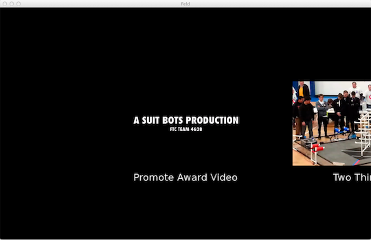

greenhouse-vidswitcher
======================

A simple video switcher using [Oblong](http://oblong.com/)'s [Greenhouse SDK](http://greenhouse.oblong.com/).

Written originally for [The Suit Bots (FTC Team 4628)](http://suitbots.com/) to
show their videos at [FIRST Tech Challenge](http://www.usfirst.org/roboticsprograms/ftc)
tournaments.  The Suit Bots' tournament display routes input via a
[MaKey MaKey](http://makeymakey.com/).  Input via
[g-speak mobile](https://itunes.apple.com/us/app/g-speak-mobile/id460504931?mt=8)
is supported as well.

Building
--------

You'll need the following to build greenhouse-vidswitcher

* Oblong's Greenhouse SDK installed in /opt/oblong/Greenhouse
* Xcode command line tools

Those requirements satisfied, building should be a simple matter of running `make`.
The resultant binary is called "`vids`."

Running
-------

`vids` demands one argument: A list of the videos that you want to display.  Its format
is as follows

    !<tag:oblong.com,2009:slaw/protein>
    descrips:
    - vids
    - config
    ingests:
      videos:
      - { file: "/path/to/video/1.mov", title: "First Title", audio: .3 }
      - { file: "/path/to/video/2.mp4", title: "Title Two", audio: .2 }
      - { file: "/path/to/more/videos.mov", title: "More Titles", audio: .5 }

The videos will be displayed in the order that they are described.  The keys describing
the individual videos are as follows:

* **file**: The path to the video file
* **title**: The title to be displayed under the video
* **audio**: The amount to scale the video's volume by (default: 1.0)

Example:

    ./vids example.prot

`vids` will run in full-screen mode if the environment variable FULLSCREEN is set:

    env FULLSCREEN=yes ./vids example.prot

Controls
--------

### Keyboard/MaKey MaKey

* **space bar**: Play/Pause current video
* **down arrow**: Stop/Rewind current video
* **up arrow**: Toggle pushback
* **left arrow**: Switch to the video on the left (if any)
* **right arrow**: Switch to the video on the right (if any)

### g-speak mobile

* **swipe left/right**: Switch to the video on the left/right
* **swipe up/down**: Pushback
* **double tap**: Play/Pause current video
* **triple tap**: Stop/Rewind current video
